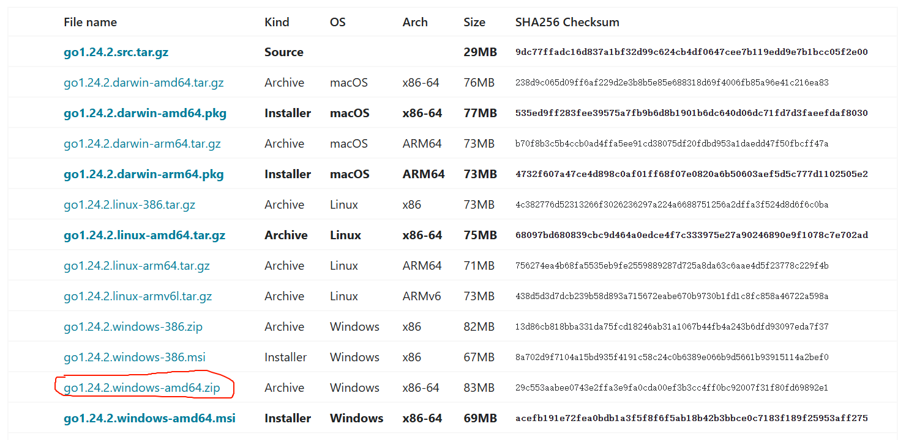
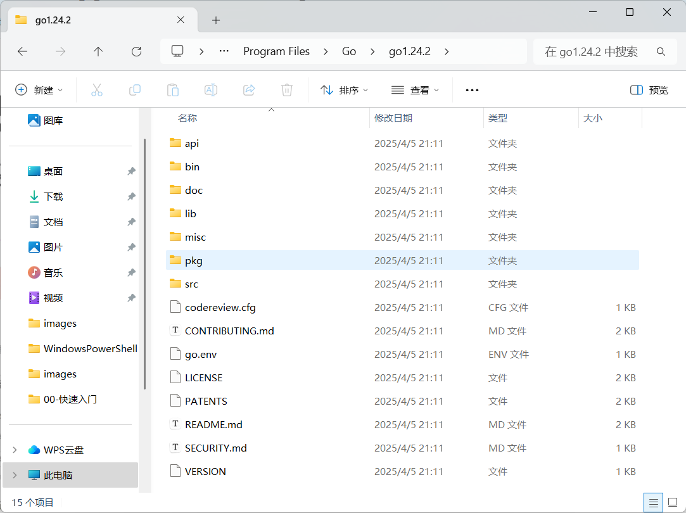
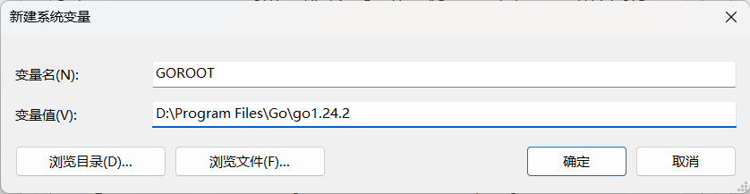
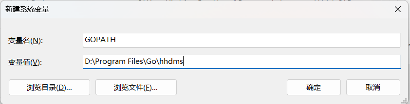
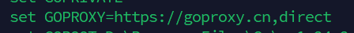

## 环境安装
### 安装Go
本机环境
本机系统: Windows 11系统
Go版本: 1.24.2
安装方式: zip压缩包
下载地址: [https://golang.google.cn/dl/](https://golang.google.cn/dl/)，这里我选择zip压缩包的方式安装。

安装路径: `D:\Program Files\Go\go1.24.2`，解压后，内容如下:

配置系统环境变量
1. GOROOT: Go的安装路径，用全局执行Go的相关命令。
     
     path中也需要配置
     
2. GOPATH: Go的工作路径，工程代码存放的位置，此目录下，一个文件夹就是一个工程。
     
       path中也需要配置
       
3. GOPORXY: Go的代理，用于下载Go的依赖包，由于go需要翻墙使用，需要配置代理，使用七牛云的代理。`go env` 可以检查环境变量的配置是否正确。
```bash
go env -w GOPROXY=goproxy.cn,direct
```

4. 测试Go是否安装成功
```bash
go version
```

**这样就代表Go的环境已经安装成功！！！**