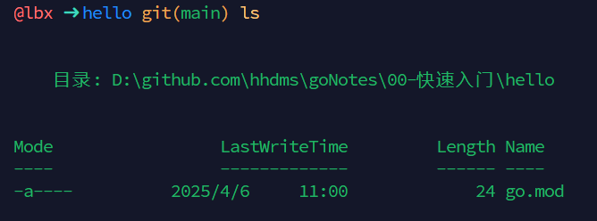
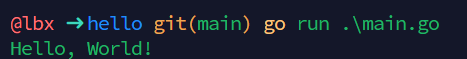

## 环境安装
### 1. 安装Go
**本机环境**
本机系统: Windows 11 x86-64系统
Go版本: 1.24.2
安装方式: zip压缩包
**下载地址:** [https://golang.google.cn/dl/](https://golang.google.cn/dl/)，这里我选择zip压缩包的方式安装。

**安装路径:** `D:\Program Files\Go\go1.24.2`，解压后，内容如下:


**配置系统环境变量**

1. GOROOT: Go的安装路径，用全局执行Go的相关命令。
     
     path中也需要配置
     
2. GOPATH: Go的工作路径，工程代码存放的位置，此目录下，一个文件夹就是一个工程。
     
       path中也需要配置
       
3. GOPORXY: Go的代理，用于下载Go的依赖包，由于go需要翻墙使用，需要配置代理，使用七牛云的代理。`go env` 可以检查环境变量的配置是否正确。
```bash
go env -w GOPROXY=goproxy.cn,direct
```

4. 测试Go是否安装成功
```bash
go version
```

**这样就代表Go的环境已经安装成功！！！**

### 2. 入门案例
新建一个文件夹，命名为`hello`，运行`go mod init hello`，初始化Go的模块，会在当前文件夹下生成一个`go.mod`文件，内容如下:
```bash
go mod init hello
```

新建一个`main.go`文件，内容如下:
```go
// package 定义包名 main 包名
package main

// import 引用库 fmt 库名
import "fmt"

// func 定义函数 main 函数名
func main() {
	// fmt 包名 . 调用 Print 函数,并且输出定义的字符串
	fmt.Print("Hello, World!")
}
```
运行`go run main.go`，会输出`Hello, World!`，代表Go的环境已经安装成功！！！


### 3. 开发工具
**Goland**
GoLand 是 JetBrains 公司推出的 Go 语言集成开发环境，与我们用的 WebStorm、PhpStorm、PyCharm 是一家，同样支持 Windows、Linux、macOS 等操作系统。
下载地址: [https://www.jetbrains.com/go](https://www.jetbrains.com.cn/)
软件是付费的，网上有激活教程。
**VS Code** 

下载地址: [https://code.visualstudio.com/](https://code.visualstudio.com/)

### 4. 学习网站
* Go语言：https://golang.org/
* Go语言中文网：https://studygolang.com/
* Go语言包管理：https://gopm.io/
* 地鼠文档：https://www.topgoer.cn/