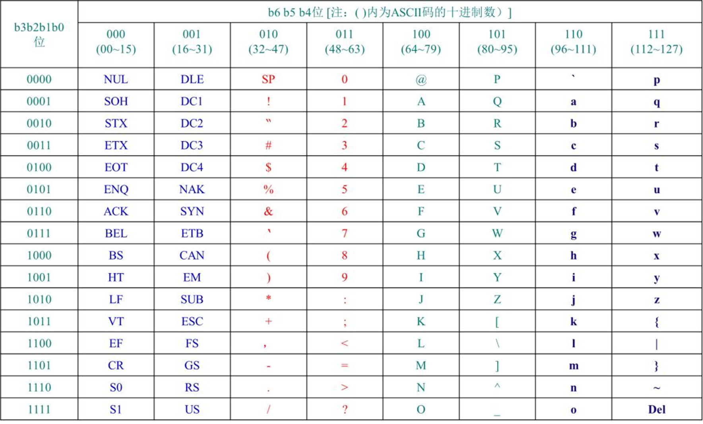

### Go的数据类型
Go 语言的数据类型包括以下几种:
* 数值类型: `整数` 和 `浮点数`
* 布尔类型: `bool`,值为`true`或`false`
* 字符串类型: `string`
* 字符类型: `byte`和`rune`
* 派生类型: `指针(Pointer)`、`数组(Array)`、`切片(Slice)`、`结构体(Struct)`、`函数(Function)`、`映射(Map)`、`通道(Channel)`、`接口(Interface)`、`Any(任意类型)`。
### 1. 整数类型
Go 语言的整数类型分为`有符号整数`和`无符号整数`:
* 有符号整数: `int`、`int8`、`int16`、`int32`、`int64`
* 无符号整数: `uint`、`uint8`、`uint16`、`uint32`、`uint64`、`uintptr`
* 整数类型的默认值为`0`。

**PS:** `8`、`16`、`32`、`64` 表示的是整数的位数。
* 有符号整数范围: `-2^n-1` 到 `2^n-1-1`
* 无符号整数范围: `0` 到 `2^n-1`
* `int` 和 `uint` 的长度和操作系统有关:
    * `32` 位操作系统: `int` 和 `uint` 的长度为`32`位。
    * `64` 位操作系统: `int` 和 `uint` 的长度为`64`位。 

**PS:** 无符号整数`uintptr`是用于存放指针的，它没有指定具体的 bit 大小但是足以容纳指针。`uintptr` 类型只有在`底层编程`时才需要，特别是Go语言和C语言函数库或操作系统接口相交互的地方。
**示例:**
```go
package main

import "fmt"

func main() {
    var a int = 10
    var b uint = 20
    fmt.Printf("a = %d\n", a) // 10
    fmt.Printf("b = %d\n", b) // 20

}
```
### 2. 浮点数类型
Go 语言的浮点数类型包括`float32`和`float64`，它们都遵循`IEEE-754`标准。:
* `float32`: 范围`约1.4e-45` 到 `约3.4e38`。
* `float64`: 范围`约4.9e-324` 到 `约1.8e308`。

* 浮点数类型的默认值为`0.0`。

**示例:**

```go
package main

import "fmt"

func main() {
    var a float64 = 10.1
    // 保留小数点后两位
    fmt.Printf("a = %.2f\n", a) // 10.10
}
```
**PS:** 通常情况下优先使用`float64`，因为`float32`类型的累计计算误差很容易扩散，并且 float32 能精确表示的正整数并不是很大。

浮点数在声明的时候可以只写整数部分或者小数部分。
**示例:**
```go
package main

import "fmt"

func main() {
    var b float64 = .1111111 // 0.1111111
    var c float64 = 1.  // 1
    
    fmt.Printf("b = %.3f\n", b) // 0.111
    fmt.Printf("c = %.2f\n", c) // 1.00 
}
```
### 3. 复数类型
Go 语言的复数类型包括`complex64`和`complex128`。
复数有实部和虚部，`complex64`的实部和虚部为`32`位，`complex128`的实部和虚部为`64`位。
**示例:**
```go
package main

import "fmt"

func main() {
    var a complex64 
    a = 1 + 2i
    var b complex128 
    b = 3 + 4i
    fmt.Printf("a = %v\n", a) // (1+2i)
    fmt.Printf("b = %v\n", b) // (3+4i) 
}
```
### 4. 布尔类型
Go语言的布尔型数据只有两个值`true(真)`和`false(假)`。
* 布尔类型的默认值为`false`。
* 布尔类型的变量不能参与任何计算。
* 布尔类型的变量不能转换为其他类型。

**示例:**
```go
package main

import "fmt"

func main() {
    var is bool = true
    var ok bool = false
    fmt.Printf("a = %t\n", is) // true  
    fmt.Printf("b = %t\n", ok) // false
}
```
### 5. 字符串类型
Go语言中的字符串以原生数据类型出现，一个字符串是一个不可改变的字节序列，字符串可以包含任意的数据，但是通常是用来包含可读的文本。Go 语言里的字符串的内部实现使用`UTF-8`编码。 字符串的值为`双引号(")`中的内容，可以在Go语言的源码中直接添加非ASCII码字符。
* 默认值: ""。
* 字符串不可变: 字符串是一个不可变的字节序列，字符串的值在创建后不能被修改。
* 字符串的长度: 字符串的长度为字符串中包含的字符个数。
* 字符串的拼接: 字符串可以使用`+`进行拼接。

**示例:**
```go
package main

import "fmt"

func main() {
    var str string = "hello"
    fmt.Printf("a = %s\n", str) // hello 
}
```
**字符串转义符**

Go 语言的字符串常见转义符包含回车、换行、单双引号、制表符等，如下表所示。
| 转义符 | 含义 |
| -------------------- | ---- |
| \r | 回车符 |
| \n | 换行符 |
| \t | 制表符 |
| \u或\U | Unicode 字符|
| \\ | 反斜杠 |
| \\' | 单引号 |
| \\" | 双引号 |


**示例:** 打印Windows文件路径`"D:\\github.com\\hhdms\\goNotes"`。
```go
package main

import "fmt"

func main() {
    fmt.Println("str = \"D:\\github.com\\hhdms\\goNotes\"") // D:\github.com\hhdms\goNotes
}
```
**示例:** 打印多行字符串，使用`反引号`。

```go
s1 := `第一行
第二行
第三行
`
fmt.Println(s1) 
```

**PS:** 反引号间换行将被作为字符串中的换行，但是所有的转义字符均无效，文本将会原样输出。

1. 使用反引号可以进行字符串换行，反引号一般用在需要将内容进行原样输出的时候使用。

2. string是不可变，也就是初始化后不能再修改其值，除非重新赋值。

**字符串的常用操作**

| 方法                                | 介绍          |
| ----------------------------------- | ------------- |
| len(str)                            | 求长度        |
| +或fmt.Sprintf                      | 拼接字符串    |
| strings.Split                       | 分割字符串    |
| strings.contains                    | 判断是否包含  |
| strings.HasPrefix,strings.HasSuffix | 前缀/后缀判断 |
| strings.Index,strings.LastIndex     | 子串出现位置  |
| strings.Join                        | join操作      |

### 6.字符类型
Go 语言的字符类型包括`byte`和`rune`。
* `byte`类型是`uint8`的别名，代表`ASCII`码的一个字符。
* `rune`类型是`int32`的别名，代表一个`Unicode`字符。当需要处理中文、日文或者其他复合字符时，则需要用到`rune`类型。

**PS:** ASCII 码的一个字符占一个字符

`ASCII` 码对照表:

**PS:** `ASCII` 定义 128 个字符，由码位 0 – 127 标识。它涵盖英文字母，拉丁数字和其他一些字符。

**示例:**
```go
// 使用单引号，表示一个字符
var ch byte = 'A'
// 在ASCII码表中，A的码位为65，可以使用65表示A
var ch byte = 65
//65的八进制表示是101，所以使用八进制定义 \后面紧跟着长度为 3 的八进制数
var ch byte = '\101'
//65使用十六进制表示是41，所以也可以这么定义 \x 总是紧跟着长度为 2 的 16 进制数
var ch byte = '\x41'
fmt.Printf("%c",ch) //A
```

**Unicode** 是 ASCII 的超集，数字0–127在ASCII中的含义与在Unicode中的含义相同。

**Unicode**为每种语言中的每个字符设定了统一并且唯一的二进制编码，以满足跨语言、跨平台进行文本转换、处理的要求。

使用`Unicode`字符时，需要在`16`进制数之前加上前缀`\u`或者`\U`。

```go
var ni rune = 20320     //你
var hao rune = '\u597D' //好
var hao1 = rune('好')
//格式化说明符%c用于表示字符，%v或%d会输出用于表示该字符的整数，%U输出格式为 U+hhhh 的字符串。
fmt.Printf("%c,%c,%U", ni, hao, hao1) //你,好,U+597D
```
**修改字符串**

使用`rune`和`byte`修改字符串，需要先将其转换成`[]rune`或`[]byte`，完成后再转换为`string`。无论哪种转换，都会重新分配内存，并复制字节数组。

```go
str1 := "hello"
// 强制类型转换
byteS1 := []byte(str1)
byteS1[0] = 'H'
fmt.Println(string(byteS1)) // Hello

str2 := "你好"
// 强制类型转换
runeS2 := []rune(str2)
runeS2[0] = '他'
fmt.Println(string(runeS2)) // 他好
```

